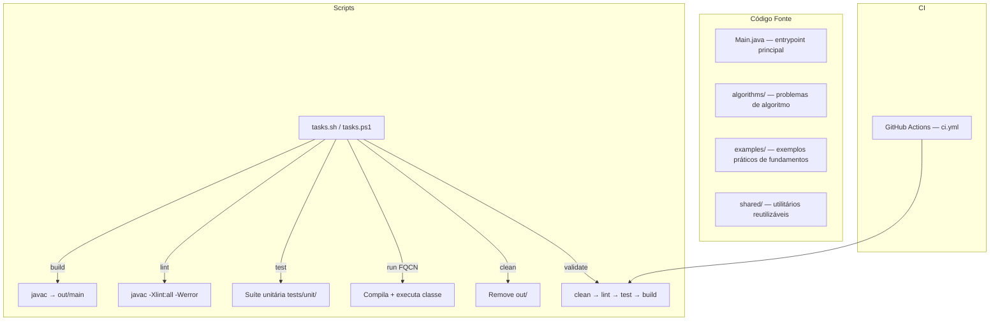

<div align="center">

# Praticando Java

[](https://github.com/ESousa97/praticando-java/actions/workflows/ci.yml)
[](https://www.codefactor.io/repository/github/esousa97/praticando-java)
[](https://opensource.org/licenses/MIT)
[](#)

**Projeto educacional para prática de fundamentos Java 21 — pacote `io.github.enoquesousa.praticandojava` organizado em 3 subpacotes (`algorithms/` para resolução de problemas, `examples/` para exemplos práticos de operadores e estruturas de controle, `shared/` para utilitários), compilação com `javac -Xlint:all -Werror` como lint estático, scripts dual-platform Bash (`tasks.sh`) e PowerShell (`tasks.ps1`) com 6 tarefas (build, lint, test, run, clean, validate), suíte de testes unitários, CI no GitHub Actions e Dependabot para workflows.**

</div>

---

> **⚠️ Projeto Arquivado**
> Este projeto não recebe mais atualizações ou correções. O código permanece disponível como referência e pode ser utilizado livremente sob a licença MIT. Fique à vontade para fazer fork caso deseje continuar o desenvolvimento.

---

## Índice

- [Sobre o Projeto](#sobre-o-projeto)
- [Funcionalidades](#funcionalidades)
- [Tecnologias](#tecnologias)
- [Arquitetura](#arquitetura)
- [Estrutura do Projeto](#estrutura-do-projeto)
- [Começando](#começando)
  - [Pré-requisitos](#pré-requisitos)
  - [Instalação](#instalação)
  - [Uso](#uso)
- [Scripts Disponíveis](#scripts-disponíveis)
- [Testes](#testes)
- [FAQ](#faq)
- [Licença](#licença)
- [Contato](#contato)

---

## Sobre o Projeto

Projeto educacional para prática de fundamentos de Java com foco em operadores, estruturas de controle e resolução de problemas de algoritmo. O repositório foi organizado com padrão de produção para facilitar manutenção, revisão e evolução incremental.

O repositório prioriza:

- **Organização por pacotes semânticos** — Código fonte em `io.github.enoquesousa.praticandojava` com 3 subpacotes: `algorithms/` para problemas de algoritmo, `examples/` para exemplos práticos (operadores, controle de fluxo, I/O), `shared/` para utilitários reutilizáveis entre exemplos
- **Lint via compilação** — `javac -Xlint:all -Werror` como lint estático: todos os warnings tratados como erros, garantindo código limpo sem dependência de ferramentas externas
- **Scripts dual-platform** — `tasks.sh` (Bash para Linux/macOS) e `tasks.ps1` (PowerShell para Windows) com interface idêntica de 6 tarefas: `build`, `lint`, `test`, `run`, `clean`, `validate`
- **Pipeline de qualidade** — `validate` executa `clean` → `lint` → `test` → `build` em sequência, reprodutível localmente e no CI
- **CI no GitHub Actions** — Pipeline automatizada na branch `main` com Dependabot para atualização de workflows
- **Entrypoint configurável** — `run` compila e executa qualquer classe pelo FQCN (ex.: `io.github.enoquesousa.praticandojava.examples.ScreenMatch`)

---

## Funcionalidades

- **Exemplos de fundamentos** — Classes práticas demonstrando operadores aritméticos, lógicos e relacionais, estruturas condicionais (if/else, switch), casting e conversão de tipos, entrada/saída com Scanner
- **Algoritmos** — Resolução de problemas clássicos com abordagem didática
- **Utilitários compartilhados** — Pacote `shared/` com helpers reutilizáveis entre exemplos
- **Compilação com warnings como erros** — `javac -Xlint:all -Werror` garante qualidade estática sem ferramentas adicionais
- **Execução por classe** — Script `run` aceita FQCN e compila + executa em um comando
- **Testes unitários** — Suíte em `tests/unit/java/` validando comportamento dos exemplos

---

## Tecnologias


---

## Arquitetura



### Pacotes e Responsabilidades

| Pacote | Responsabilidade |
| --- | --- |
| `io.github.enoquesousa.praticandojava` | Pacote raiz com `Main.java` (entrypoint) |
| `.algorithms` | Resolução de problemas clássicos de algoritmo |
| `.examples` | Exemplos práticos: operadores, estruturas de controle, I/O, casting |
| `.shared` | Utilitários compartilhados entre exemplos |

### Decisões de Design

| Decisão | Justificativa |
| --- | --- |
| Java 21 LTS | Versão com suporte de longo prazo, features modernas |
| `javac -Xlint:all -Werror` como lint | Zero dependências externas, warnings = erros |
| Scripts dual Bash/PowerShell | Cross-platform com interface idêntica |
| Saída em `out/main` | Separação de artefatos compilados do código fonte |
| FQCN no `run` | Permite executar qualquer classe sem modificar scripts |

---

## Estrutura do Projeto

```
praticando-java/
├── src/
│   └── main/
│       └── java/
│           └── io/github/enoquesousa/praticandojava/
│               ├── Main.java                   # Entrypoint principal
│               ├── algorithms/                 # Problemas de algoritmo
│               ├── examples/                   # Exemplos práticos (ScreenMatch, etc.)
│               └── shared/                     # Utilitários compartilhados
├── tests/
│   └── unit/
│       └── java/
│           └── io/github/enoquesousa/praticandojava/
│               └── ...                         # Testes unitários
├── scripts/
│   ├── tasks.sh                                # Bash: build, lint, test, run, clean, validate
│   └── tasks.ps1                               # PowerShell: mesmas 6 tarefas
├── docs/
│   └── architecture.md                         # Detalhes de arquitetura
├── .github/
│   ├── workflows/
│   │   └── ci.yml                              # Pipeline: lint + test + build
│   ├── ISSUE_TEMPLATE/                         # Templates de issue
│   └── PULL_REQUEST_TEMPLATE.md
├── .editorconfig
├── .gitattributes
├── .gitignore
├── .env.example
├── CHANGELOG.md
├── CONTRIBUTING.md
├── CODE_OF_CONDUCT.md
├── SECURITY.md
└── LICENSE                                     # MIT
```

---

## Começando

### Pré-requisitos

- Java JDK 21+
- Bash (Linux/macOS) ou PowerShell 7+ (Windows)

### Instalação

**Linux/macOS:**

```bash
git clone https://github.com/ESousa97/praticando-java.git
cd praticando-java
cp .env.example .env
bash scripts/tasks.sh validate
```

**Windows PowerShell:**

```powershell
git clone https://github.com/ESousa97/praticando-java.git
cd praticando-java
Copy-Item .env.example .env
./scripts/tasks.ps1 -Task validate
```

### Uso

Executar o entrypoint principal:

```bash
bash scripts/tasks.sh run io.github.enoquesousa.praticandojava.Main
```

Executar um exemplo específico:

```bash
bash scripts/tasks.sh run io.github.enoquesousa.praticandojava.examples.ScreenMatch
```

---

## Scripts Disponíveis

| Tarefa | Bash | PowerShell | Descrição |
| --- | --- | --- | --- |
| `build` | `bash scripts/tasks.sh build` | `./scripts/tasks.ps1 -Task build` | Compila código em `out/main` |
| `lint` | `bash scripts/tasks.sh lint` | `./scripts/tasks.ps1 -Task lint` | Valida com `javac -Xlint:all -Werror` |
| `test` | `bash scripts/tasks.sh test` | `./scripts/tasks.ps1 -Task test` | Executa suíte unitária |
| `run` | `bash scripts/tasks.sh run <FQCN>` | `./scripts/tasks.ps1 -Task run -Class <FQCN>` | Compila e executa classe |
| `clean` | `bash scripts/tasks.sh clean` | `./scripts/tasks.ps1 -Task clean` | Remove `out/` |
| `validate` | `bash scripts/tasks.sh validate` | `./scripts/tasks.ps1 -Task validate` | clean → lint → test → build |

---

## Testes

```bash
bash scripts/tasks.sh test
```

Testes unitários localizados em `tests/unit/java/io/github/enoquesousa/praticandojava/`, executados como parte da pipeline `validate`.

---

## FAQ

<details>
<summary><strong>Por que javac como lint em vez de Checkstyle ou SpotBugs?</strong></summary>

O projeto prioriza zero dependências externas para manter simplicidade educacional. `javac -Xlint:all -Werror` transforma todos os warnings do compilador em erros, garantindo qualidade estática sem necessidade de configurar ferramentas adicionais. Para um projeto didático de fundamentos, isso é suficiente.
</details>

<details>
<summary><strong>Como adicionar um novo exemplo?</strong></summary>

Crie uma classe com `public static void main(String[] args)` no pacote `io.github.enoquesousa.praticandojava.examples`, depois execute com `bash scripts/tasks.sh run io.github.enoquesousa.praticandojava.examples.SuaClasse`.
</details>

<details>
<summary><strong>O projeto usa Maven ou Gradle?</strong></summary>

Não. A compilação é feita diretamente com `javac` via scripts de tasks, sem gerenciador de dependências. Isso mantém o foco educacional nos fundamentos da linguagem sem introduzir complexidade de build tools.
</details>

<details>
<summary><strong>Por que scripts em Bash e PowerShell?</strong></summary>

Para garantir experiência cross-platform idêntica. `tasks.sh` para Linux/macOS e `tasks.ps1` para Windows, ambos com as mesmas 6 tarefas e mesma interface de linha de comando.
</details>

---

## Licença

Este projeto está sob a licença MIT. Veja o arquivo [LICENSE](LICENSE) para mais detalhes.

```
MIT License - você pode usar, copiar, modificar e distribuir este código.
```

---

## Contato

**José Enoque Costa de Sousa**

[](https://www.linkedin.com/in/enoque-sousa-bb89aa168/)
[](https://github.com/ESousa97)
[](https://enoquesousa.vercel.app)

---

<div align="center">

**[⬆ Voltar ao topo](#praticando-java)**

Feito com ❤️ por [José Enoque](https://github.com/ESousa97)

**Status do Projeto:** Archived — Sem novas atualizações

</div>
